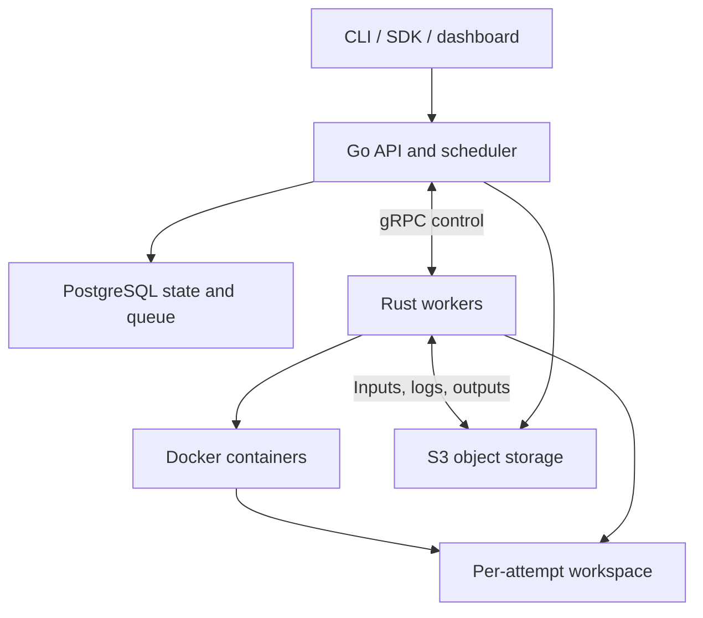
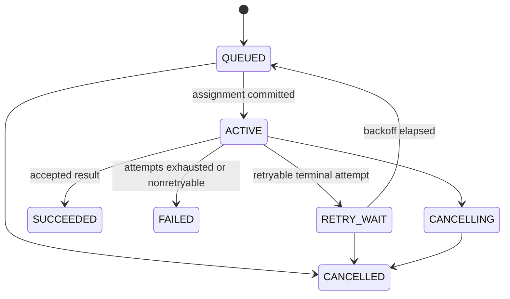

# Dispatch — Distributed Execution Platform

**Detailed product and engineering specification**  
Version: 0.1 design draft · September 21, 2026  
Implementation: Go control plane, Rust workers, PostgreSQL, gRPC, Docker, S3

> Submit containerized workloads, distribute them across machines, and recover from worker failures while preserving logs, artifacts, and execution history.

This is an implementation specification, not a description of an existing product. Examples define proposed interfaces. Performance figures are acceptance targets to measure. The document prioritizes a usable research execution platform and explicitly scopes later features.

## 1. Product and intended user

Dispatch turns a collection of dedicated Linux machines into a shared batch execution pool. A developer supplies an image, command, inputs, and resource requirements. Dispatch queues the job, selects an eligible machine, runs it, streams progress, and publishes the result. If an attempt fails for a retryable reason, Dispatch records that attempt and starts another according to policy.

The first user is a researcher or engineer running independent evaluations, parameter sweeps, preprocessing jobs, or backtests. The first real workload should be a small CPU-based research evaluation from the user's own workflow. Dispatch should eliminate manual SSH sessions, machine selection, ad hoc retry scripts, and scattered output directories.

A job submission is declarative: the user requests an outcome, while Dispatch manages individual execution attempts. A failed machine does not erase the job's identity or history.

### 1.1 Concrete user journey

1. Package an evaluation script in a container image.
2. Upload a versioned dataset once.
3. Submit a matrix of 3 algorithms × 3 learning rates × 3 seeds.
4. See 27 independent jobs queued and placed across registered workers.
5. Follow logs and compare final metrics.
6. Lose a worker halfway through the run; eligible interrupted jobs retry elsewhere.
7. Download a manifest connecting every result to its image, input, parameters, and attempt history.

The value is useful execution management, not a promise to accelerate the algorithm itself. Dispatch does not make Python computation inherently faster.

### 1.2 What makes this a substantial systems project

- Resource-aware placement with durable reservations.
- Job leases, worker sessions, failure detection, and stale-attempt fencing.
- Recovery from ambiguous delivery and process crashes.
- Bounded log and artifact pipelines with backpressure.
- Durable submission, result publication, cancellation, and retry semantics.
- Reproducible manifests and fault-injection tests of the platform itself.

### 1.3 Deployment boundary

The initial product runs trusted workloads on dedicated or explicitly allocated machines managed by the project owner. It does not assume permission to install Docker or a scheduler on shared university infrastructure. Existing Slurm-managed clusters would require a later executor adapter; users must not bypass the site's resource manager.

## 2. Scope and release plan

| Release | Included | Explicitly deferred |
| --- | --- | --- |
| v0.1 | CPU jobs, single control-plane process, multiple Rust workers, Docker, durable queue, leases/retries, CLI, logs, artifacts, parameter sweeps | GPUs, public arbitrary-code execution, autoscaling, multi-controller HA, workflow DAGs |
| v0.2 | Dashboard, Python SDK, integer GPU assignment on supported hosts, application checkpoint references, project fairness improvements | Fractional GPUs, transparent process migration, distributed model-training orchestration |
| Later | Slurm/Kubernetes adapters, stronger sandboxing, autoscaling, DAG dependencies, multi-controller deployment | Reimplementing every feature of a mature cluster manager |

v0.1 must be usable from the CLI. The dashboard cannot block the first end-to-end demonstration. Jobs can be written in any language that runs in the supported image environment; the Go/Rust split describes Dispatch itself.

### 2.1 Non-goals

- Exactly-once execution of arbitrary user code or external side effects.
- Automatic checkpointing of arbitrary processes.
- A distributed filesystem, image registry, container runtime, or consensus system built from scratch.
- Sub-millisecond dispatch or latency-sensitive online serving.
- Guaranteed safe hosting of hostile tenants with ordinary Docker defaults.
- Kafka or Redis as mandatory dependencies for the initial deployment.

## 3. Architecture and technology decisions



### 3.1 Deployable components

| Component | Technology | Responsibility |
| --- | --- | --- |
| `dispatch-server` | Go | HTTP API, worker gRPC API, scheduler, lease reaper, artifact authorization, event feeds |
| `dispatch` | Go | Submission, inspection, cancellation, logs, artifact commands |
| `dispatch-worker` | Rust + Tokio | Docker supervision, local accounting, lifecycle journal, heartbeats, transfers |
| Metadata database | PostgreSQL | Authoritative job/attempt state, reservations, identities, event history |
| Object storage | AWS S3; tested S3-compatible development backend | Immutable versions of inputs, log segments, metrics, outputs |
| Runtime | Docker Engine on Linux | Image execution, process isolation, CPU/memory/PID limits |
| Optional dashboard | React + TypeScript | Jobs, workers, sweeps, logs, metrics, attempts |
| Optional client | Python | Submit/wait/download from research scripts |

The server is one modular application, not a collection of microservices. Go packages separate API, scheduling, persistence, and reconciliation. A worker is one Rust process per dedicated host in the first supported deployment.

### 3.2 Libraries and build defaults

Proposed Go dependencies: `net/http`, `log/slog`, `pgx`, generated Protobuf/grpc-go, AWS SDK for Go, and a small CLI library such as Cobra. SQL migrations remain explicit; use generated query bindings if they reduce schema drift.

Proposed Rust dependencies: Tokio, Tonic/Prost, Serde, tracing, a maintained Docker Engine client, and an HTTP client for scoped object transfers. Verify exact dependency versions in the initial build spike and pin the toolchains and lockfiles. No FFI or shared memory between Go and Rust.

Use PostgreSQL for queue and state so assignment is transactional with the job record. `SKIP LOCKED` is suitable for queue-like consumers, but it does not itself implement resource scheduling, leases, or fairness. [PostgreSQL SELECT documentation](https://www.postgresql.org/docs/current/sql-select.html).

Kafka may eventually distribute high-volume events to multiple downstream consumers. Redis may become a disposable cache. Neither is needed to decide which worker owns a job.

### 3.3 Three sources of truth

1. **PostgreSQL:** current authorized attempt, job outcome, resource reservations, accepted artifact versions.
2. **Worker journal and runtime inspection:** what may still be physically running on that host.
3. **Object storage:** uploaded bytes; upload alone does not make a result accepted.

Disagreement is resolved through reconciliation. Neither an in-memory scheduler map nor a worker's late completion may overwrite authoritative state without validation.

## 4. User-facing job specification

```yaml
apiVersion: dispatch.dev/v1alpha1
kind: Job
metadata:
  name: antibody-evaluation
  project: research
  labels:
    experiment: masking-comparison
spec:
  image: registry.example.org/antibody-eval:2026-09
  command: [python, evaluate.py]
  args: [--dataset, /inputs/antibodies, --output, /outputs]
  env:
    MASKING_METHOD: knn
    LEARNING_RATE: "0.0001"
    SEED: "1"
  resources:
    cpuMillis: 2000
    memoryMiB: 4096
    scratchMiB: 8192
  placement:
    labels:
      architecture: amd64
  inputs:
    - dataset: antibodies-v1
      mountPath: /inputs/antibodies
  outputs:
    - name: metrics
      path: /outputs/metrics.json
      required: true
      maxBytes: 1048576
    - name: predictions
      path: /outputs/predictions.parquet
      required: true
      maxBytes: 536870912
  timeouts:
    startupSeconds: 300
    executionSeconds: 1800
    finalizationSeconds: 300
  retry:
    maxAttempts: 3
    on: [WORKER_LOST, RUNTIME_UNAVAILABLE, TRANSFER_FAILED]
    initialBackoffSeconds: 5
    maxBackoffSeconds: 60
  terminationGraceSeconds: 10
  network: disabled
```

This example references a placeholder registry and dataset. It illustrates the contract, not a publicly runnable image.

### 4.1 Schema semantics

- `command` and `args` are argument arrays. Dispatch does not add an implicit shell.
- `cpuMillis: 2000` means a reservation and configured CPU limit equivalent to 2 CPU cores; it is not dedicated-core pinning.
- Memory is reserved and hard-limited. The deployment must verify host support and swap policy.
- Scratch is reserved in scheduling and bounded by the supported workspace implementation described later.
- Image tags are resolved to a digest at admission, before the immutable job is queued. Retries use the same digest.
- Dataset names resolve to immutable registered object versions and a manifest at admission.
- Parameters and non-secret environment values become part of the immutable specification hash.
- Resource or image edits create a new job; they do not mutate an active job.
- Unsupported fields and conflicting mounts are rejected. Positive sizes, finite deadlines, path limits, and project quotas are validated.

Admission can return `UNAVAILABLE` if registry/object validation is temporarily unavailable. The idempotency contract makes retrying the submission safe; no partially admitted job appears queued.

### 4.2 CLI workflow

```bash
dispatch dataset upload ./data --name antibodies-v1
dispatch submit job.yaml
dispatch jobs list --project research
dispatch jobs get <job-id>
dispatch logs <job-id> --follow
dispatch attempts list <job-id>
dispatch artifacts download <job-id> --output ./results
dispatch cancel <job-id>
dispatch workers list
dispatch workers drain <worker-id>
```

CLI output always includes job IDs. `--json` emits a stable machine-readable representation. `dispatch wait` exits zero on success, one on failed/cancelled jobs, and two on client/infrastructure errors. A timed-out wait does not cancel the job unless explicitly requested.

## 5. Parameter sweeps and result comparison

```yaml
apiVersion: dispatch.dev/v1alpha1
kind: Sweep
metadata:
  name: masking-grid
  project: research
spec:
  jobTemplateFile: job.yaml
  matrix:
    MASKING_METHOD: [random, contact, knn]
    LEARNING_RATE: ["0.0001", "0.0003", "0.001"]
    SEED: ["1", "2", "3"]
  maxConcurrent: 6
  failFast: false
```

The client resolves the referenced template into the request; the server never reads arbitrary client paths. Matrix keys override matching environment variables. Sort parameter names and retain user value order to produce stable child indices. The 27 child job specifications are immutable and linked to one sweep.

v0.1 caps a sweep at 1,000 jobs and creates the sweep and children in one bounded transaction after validation. Duplicate submission with the same project-scoped idempotency key returns the same sweep. `maxConcurrent` limits active child attempts, including startup and finalization. Terminal child states derive sweep progress.

`failFast: true` cancels unstarted children on the first permanently failed child; running children continue unless `cancelRunningOnFailure` is separately enabled. Retrying a failed sweep creates new jobs linked to the originals rather than erasing history.

The workload may write a bounded `metrics.json` containing named scalar values. Dispatch stores validated final metrics for filtering/comparison. Live metric ingestion and time-series experiment tracking are later features.

## 6. Entities and PostgreSQL schema

UUIDs identify projects, jobs, attempts, workers, sweeps, and artifacts. Attempt numbers are monotonic per job. All server timestamps use UTC; lease comparisons use the database's clock.

| Table | Principal fields and constraints |
| --- | --- |
| `projects` | ID, name, CPU/memory/concurrency quotas, enabled flag |
| `jobs` | ID, project/sweep IDs, spec/hash, state, next eligible time, attempt counter, current attempt, cancel request, accepted result |
| `attempts` | ID, job ID/number, worker/session, fencing generation, state, deadlines, lease expiry, exit code, reason, completion digest |
| `workers` | ID, session generation, labels, allocatable resources, state, last heartbeat, drain flag |
| `reservations` | Attempt ID unique, worker ID, resource quantities, state: active/released/quarantined |
| `sweeps` | ID, project, canonical template/matrix, concurrency cap, policy |
| `artifacts` | ID, attempt or dataset owner, upload ID, object key/version, checksum, size, state |
| `datasets` | ID, project/name, immutable manifest and content references |
| `job_events` | Per-job sequence, job/attempt, type, bounded JSON payload, database time |
| `log_segments` | Attempt, stream, first/last sequence, object version, gaps, size |
| `idempotency_keys` | Project, endpoint, key, canonical request hash, response reference |
| `worker_requests` | Worker/session/request ID, request hash, durable acquisition result |

Required uniqueness: `(job_id, attempt_number)`, project/endpoint/idempotency key, attempt upload ID, and a partial unique index on active attempts per job. `jobs.current_attempt_id` must agree with the active attempt. A job may have many historical attempts but at most one authoritative active attempt.

Queue index: project, state, `next_eligible_at`, priority, creation time. Lease index: active attempts ordered by lease expiry. Events: job ID and sequence. Enforce nonnegative resource values, finite state enums, and foreign keys.

Store validated job specs as JSONB for reproducibility; use typed columns for frequently queried scheduling fields. Never put large logs or artifact bytes into JSONB.

### 6.1 Transaction discipline

Assignment and reservation changes run in short transactions. v0.1 serializes these transitions with a PostgreSQL transaction-scoped advisory lock for the cluster, then locks job rows in sorted ID order, attempts, and affected worker/project accounting rows. No runtime, registry, object-store, or network RPC occurs inside these transactions.

Lease renewal only locks its job and attempt; it never subsequently acquires the cluster advisory lock. The implementation must document and test this ordering to avoid deadlocks. Terminalization, expiry, cancellation, and session fencing use the reservation transition path.

Evaluate authorization expiry using fresh database wall time after acquiring the relevant row locks, rather than a transaction-start timestamp captured before waiting. Set short lock/statement timeouts and retry safe transactions by their operation identity. A blocked transaction must not revive an already-expired lease.

This deliberately simple serialization is a correctness baseline, not the ultimate throughput architecture. Future per-project or per-worker concurrency requires preserving all invariants, not just adding `SKIP LOCKED` to the query.

## 7. Job and attempt state machines

### 7.1 Job state



Terminal job states are immutable. A cancellation arriving after success returns the existing result. A rerun creates a new job with a parent reference.

### 7.2 Attempt state

| State | Meaning |
| --- | --- |
| `ASSIGNED` | Reservation and lease committed; worker may not yet have received it |
| `STARTING` | Assignment acknowledged; input staging/image preparation/container start underway |
| `RUNNING` | Runtime confirms the container is running |
| `FINALIZING` | Process exited; logs/artifacts/result publication in progress |
| `SUCCEEDED` | Exit/result/artifact requirements accepted transactionally |
| `FAILED` | Known runtime, application, timeout, or transfer failure |
| `LOST` | Authorization expired without a valid completion; physical status may be unknown |
| `CANCELLED` | Cancellation decision terminalized; physical cleanup status tracked separately |

An explicit `cancel_requested` flag applies to any active phase. Worker reports cannot move an attempt backward. Events record phase changes; heartbeats are not inserted as full events on every tick.

### 7.3 Core invariants

1. No job has two authoritative active attempts.
2. Every active assignment has exactly one reservation and one fencing generation.
3. Committed reservations on an eligible worker do not exceed its configured allocatable capacity.
4. An expired/fenced attempt cannot renew, change job state, or publish an accepted result.
5. Only an accepted successful attempt supplies the job's canonical output manifest.
6. Cancellation intent prevents a later success from winning, unless success committed first.
7. Loss of connectivity never grants additional execution authority.
8. Upload success is not job success; accepted metadata determines visible canonical results.

Physical duplicate execution during failure recovery remains possible. These invariants constrain ownership and publication, not exactly-once user code.

## 8. Worker registration and identity

Workers register using provisioned credentials and advertise OS/architecture, labels, runtime capabilities, and configured allocatable resources. Server authorization bounds claimed capacity; a worker cannot arbitrarily register into another project or pool.

`worker_id` identifies an installed host; `session_id` and monotonic session generation identify one agent incarnation. A credential authenticates the host, while the session prevents an old process from acting as its new replacement. Reject concurrent active sessions unless the operator explicitly initiates takeover.

On restart, the worker obtains a new session through the server's recovery protocol. Old assignments are fenced. Before advertising usable capacity, the agent enumerates Dispatch-labeled containers and reconciles or stops old-session executions. v0.1 stops them and retries from the beginning; adopting running containers is deferred.

A heartbeat includes session identity, health, disk pressure, runtime status, and current execution inventory. Server reservations remain authoritative for scheduling; reported free resources are a safety check, not a replacement for reservations.

Worker states: `REGISTERING`, `READY`, `DRAINING`, `SUSPECT`, `OFFLINE`, `QUARANTINED`. A draining worker receives no new jobs but may finish current attempts.

## 9. Scheduling and durable assignment

### 9.1 Pull-based acquisition

Rust workers call `AcquireWork` when local capacity allows. The server selects an eligible job for that worker. v0.1 returns at most one assignment per request, with only one outstanding acquire request per worker. This avoids requiring inbound access to worker machines.

The Go scheduler owns the placement decision, even though workers initiate acquisition. Pull-based first fit is the v0.1 policy; global optimal packing is not claimed.

### 9.2 Eligibility and ordering

Filter candidates by project access, worker labels, architecture, runtime capabilities, resource fit, queue eligibility time, project quota, and sweep concurrency. Use fixed priority levels with aging so low-priority work eventually advances.

Start with round-robin selection among eligible projects, then oldest eligible job within effective priority. The project cursor is durable. This is approximate admission fairness, not equal CPU time; long-running jobs are nonpreemptive. Later weighted fair sharing can use normalized resource consumption.

If a large job cannot fit, the scheduler may backfill smaller jobs. Record why it remains blocked and increment an age signal; v0.1 does not promise a start-time guarantee without reservations for future capacity.

### 9.3 Assignment transaction

1. Deduplicate acquisition by worker/session/request ID.
2. Acquire the reservation transition lock; validate the worker is ready and current.
3. Select and lock an eligible queued job; recheck all quotas and resource fit.
4. Increment the job's attempt counter/fencing generation.
5. Insert `ASSIGNED` attempt and active reservation.
6. Set job `ACTIVE`, current attempt, and initial lease expiry.
7. Persist acquisition response reference and assignment event.
8. Commit, then return the assignment to the worker.

If the response is lost, retrying the same request returns the same assignment rather than allocating another. The worker also fetches its durable active-assignment inventory after reconnect. A new acquisition ID cannot bypass still-reserved resources.

The assignment identity is idempotent; a lease duration is not blindly replayed. Before returning a duplicate or recovered assignment, revalidate current ownership and compute its remaining validity from the database. Return a terminal/fenced outcome if it is no longer actionable. Only an explicit valid renewal extends the lease. The worker applies its conservative deadline calculation to the returned remaining duration.

`AcquireWork` responses that contain no work are also stable for that request ID; the worker uses a new ID after a randomized polling delay. Polling is sufficient initially. Notifications can reduce latency later, but correctness must not depend on their delivery.

### 9.4 Capacity accounting

Reserve CPU, memory, scratch, and an execution slot before delivering the assignment. Keep the reservation through startup, running, and finalization to simplify accounting. Release after a confirmed stopped execution and terminal transition. This is conservative but prevents resource reuse while output handling still needs space.

On lost workers, quarantine their reservations and remove the worker from the eligible pool. Logical project/sweep active-attempt quota can be released when the attempt is fenced so a replacement can run elsewhere. Physical overlap on the lost host is possible and is reported as uncertain; it must not be hidden in claims of global resource limits.

A returned host must stop old executions and reconcile inventory before quarantined capacity becomes available again.

## 10. Leases, fencing, and failure detection

### 10.1 Initial timing defaults

| Setting | Initial default |
| --- | --- |
| Worker heartbeat | Every 5 seconds, jittered |
| Attempt renewal | Every 5 seconds, batched per worker |
| Lease duration | 30 seconds |
| Lease reaper interval | 2 seconds |
| Worker suspect threshold | 15 seconds without heartbeat |
| Control RPC deadline | 5 seconds for small mutations |
| Local authority safety margin | 5 seconds before estimated expiry |
| Shutdown grace | Job setting, default 10 seconds; bounded by authority deadline |

These are starting values for CPU batch workloads. Evaluate them under packet loss, host pauses, and overloaded PostgreSQL before claiming production reliability.

### 10.2 Renewal contract

A lease renewal includes job ID, attempt ID, generation, and worker session. In one transaction, lock the job/attempt and require: it is still current, active, authorized, and not already expired according to database time. Extend expiry and return a duration plus server timing metadata. Expired leases cannot be resurrected before the reaper notices them.

Workers measure RPC elapsed time with a monotonic clock. Compute a conservative local validity deadline from request-send time plus returned lease duration minus the safety margin; do not start a fresh full lease merely when a delayed response arrives. Discard responses received after that conservative deadline. Apply the same rule to the initial assignment response.

Before authority ends, the worker stops starting new processes and initiates termination early enough to attempt cleanup by the deadline. If the agent or host is frozen, it may fail to stop on time. Server-side fencing still prevents state/result acceptance, but cannot undo external effects of surviving user code.

### 10.3 Fencing

Every mutating worker request carries `(job_id, attempt_id, generation, worker_session)`. The server validates this tuple against current durable state. A stale attempt receives a definitive fenced response and must stop.

Fencing applies to progress, renewals, upload grants, and final result acceptance. Previously issued object upload URLs may remain valid briefly; they point only to attempt-specific object keys. They never authorize canonical result publication.

### 10.4 Reaper behavior

The reaper terminalizes expired attempts as `LOST`, clears authoritative ownership, quarantines uncertain worker capacity, and either schedules a retry or fails the job. Perform the state/reservation/event changes transactionally and idempotently. A racing renewal, completion, or cancellation must be resolved by row locks and current expiry checks.

An empty queue or unresponsive worker does not imply an attempt completed. Absence of evidence is not success.

## 11. Rust worker execution pipeline

Use separate bounded tasks for heartbeat/renewal, acquisition, per-attempt supervision, log spooling, and artifact transfer. CPU-heavy hashing/compression runs in bounded blocking pools so it cannot starve lease maintenance.

### 11.1 Attempt workflow

1. Persist the assignment in a local journal before acting on it.
2. Verify current session, generation, conservative lease deadline, and local resource capacity.
3. Acknowledge `STARTING`; stage immutable inputs and pull/verify the pinned image.
4. Create per-attempt directories and prepare mounts and limits.
5. Create a container with deterministic name and Dispatch labels; inspect on ambiguous create responses.
6. Recheck authority before starting; start exactly the container associated with this attempt.
7. Report `RUNNING`; supervise exit, deadline, cancellation, and lease loss.
8. After exit, report `FINALIZING`, gather declared outputs, and upload logs/artifacts.
9. Submit an idempotent completion request with a digest of its payload.
10. Retain enough journal/output state to retry uncertain completion, then clean up after acceptance or terminal fencing.

Local deduplication prevents repeated delivery from launching two containers for one attempt. It does not prevent two different attempts from overlapping after a partition.

### 11.2 Runtime interface

Rust modules expose a `Runtime` abstraction with create, start, inspect, wait, stop, kill, logs, and remove operations. Implement Docker first; use a deterministic fake runtime for transition testing. Do not create a container runtime from scratch.

Docker labels include worker ID, session, job ID, attempt ID, and generation. Never use `--rm` while recovery depends on inspecting exited container state. Disable automatic container restart; Dispatch owns retry decisions.

### 11.3 Resource enforcement

Translate CPU limits, hard memory limits, and PID limits to runtime settings. Docker supports these controls, but host configuration and available kernel features matter. Validate capabilities when workers register. [Docker resource constraints](https://docs.docker.com/engine/containers/resource_constraints/).

CPU reservation is admission accounting, not dedicated physical CPU isolation. Memory overcommit is disabled in v0.1. Reserve host overhead before advertising allocatable capacity. Detect OOM through runtime state rather than treating every exit 137 as proof of OOM.

Scratch needs its own implementation: use quota-backed per-attempt workspaces on a supported filesystem for the release profile. A development fallback may use conservative disk reservations plus monitoring, but must report scratch as a soft limit and reject jobs requiring strict enforcement. Generic Docker bind mounts do not automatically provide a per-job disk quota.

### 11.4 Workspace and filesystem contract

Mount inputs read-only under `/inputs`, declared output storage under `/outputs`, and scratch under `/scratch`. The default container root filesystem is read-only, with bounded writable temporary locations as needed. Reject host paths, escaping symlinks, privileged mode, devices, Docker socket mounts, and arbitrary runtime arguments in user job specs.

Output collection accepts regular files under declared paths only, with count/size limits. Resolve paths without following symlinks outside the workspace. A large or missing required output becomes an explicit finalization failure.

### 11.5 Checkpoint reality

v0.1 restarts failed jobs from the beginning. v0.2 can expose application-produced checkpoint artifacts from a prior attempt. Resuming is implemented by the workload using a supplied checkpoint path; Dispatch cannot recover arbitrary in-memory training state or transparently migrate a running process.

## 12. Retry, timeout, and cancellation semantics

### 12.1 Failure classification

| Reason | Default retry? | Meaning |
| --- | --- | --- |
| `WORKER_LOST` | Yes | Lease/session authority ended without completion |
| `RUNTIME_UNAVAILABLE` | Yes | Transient runtime failure, with old execution reconciled |
| `TRANSFER_FAILED` | Yes after bounded transfer retries | Required input/output transfer could not finish |
| `APPLICATION_EXIT` | No | User process exited nonzero; opt-in exit-code policy possible |
| `OOM` | No | Retrying unchanged resource limits is unlikely to help |
| `STARTUP_TIMEOUT` | No by default | Image/staging/start did not finish in budget |
| `EXECUTION_TIMEOUT` | No | Workload exceeded execution budget |
| `OUTPUT_INVALID` | No | Missing, unsafe, oversized, or malformed required output |
| `CANCELLED` | No | Explicit user request |

`maxAttempts` includes the initial attempt. Retry delay is exponential backoff capped at the configured maximum, with jitter. Bound startup and finalization separately from execution time; otherwise an upload could keep an attempt alive indefinitely.

Retries offer repeated execution attempts, not exactly-once behavior. Workloads that write to external systems must use their own idempotency keys or transactional logic. Dispatch exposes a stable job ID and a distinct attempt ID for this purpose.

### 12.2 Cancellation ordering

The API locks the job and records cancellation intent. A queued/retry-wait job becomes cancelled immediately. An active job becomes cancelling; subsequent renewals/status requests return stop intent, and an event feed may deliver it sooner.

The worker sends graceful termination, then forces termination after the bounded grace period. Finalize cancellation after stop confirmation; if authority expires first, fence the attempt, mark cancellation terminal, and preserve `cleanup_pending` for the uncertain host. No retry is created.

A completion transaction checks cancellation intent. If cancellation committed first, completion cannot turn the job successful. If success committed first, cancellation returns the already-successful state. Tests must exercise both orders.

### 12.3 Completion uncertainty

If a completion RPC times out, the worker retries the same completion ID/payload digest and queries authoritative state. If already accepted, the server returns the stored result even though the lease is now terminal. If the lease expired before the original completion committed, reject publication. Never rerun a job solely because the client did not receive a successful completion response.

## 13. Inputs, artifacts, and durable publication

### 13.1 Object layout

Use unique keys scoped to project/job/attempt/upload ID. Logical names are metadata, not writable shared object paths. Example categories: dataset objects, attempt outputs, log segments, and immutable manifests.

Enable bucket versioning and record exact object version IDs for accepted data. A compatible development backend must pass versioned upload/download and checksum tests; support is not assumed merely because it calls itself S3-compatible.

Workers receive short-lived scoped transfer grants, not unrestricted bucket credentials. Presigned URLs expire and can authorize uploads to a specific key; repeated use can replace that key's current object, so they are not a write-once primitive. Dispatch's accepted references pin exact versions. [AWS S3 presigned URL documentation](https://docs.aws.amazon.com/AmazonS3/latest/userguide/using-presigned-url.html).

### 13.2 Input staging

Admission resolves datasets to manifests containing object key, version, byte count, and content checksum. Workers download to temporary files, validate content, then atomically move verified inputs into a local cache. Cache entries are immutable and pinned while in use; eviction cannot delete data referenced by running attempts.

Do not trust ETag as a universal content hash. Use an explicit supported checksum or compute SHA-256 over downloaded bytes. Staging failure never exposes a partially downloaded input under its final path.

Local cache reuse saves transfer time but is not required for correctness. Initial eviction uses least-recently-used unpinned entries with configured high/low watermarks. Disk pressure stops new acquisition before threatening running jobs.

### 13.3 Output publication protocol

1. While authority remains valid, worker requests an upload grant for a declared output.
2. Server creates a pending artifact record with unique upload ID and key.
3. Worker uploads, using multipart transfer above a configurable size threshold.
4. Worker reports exact version, size, and checksum through `FinalizeUpload`.
5. Server verifies object metadata/checksum through the supported storage profile and marks the upload verified; it does not yet make the job successful.
6. Worker sends `CompleteAttempt` with exit status and the verified output/log manifest.
7. Server verifies current ownership, unexpired lease, no cancellation, required outputs, and completion digest in a transaction.
8. Server atomically accepts the attempt and points the job to that immutable result manifest.

Object verification happens outside the state transaction; transaction-time checks reference a verified immutable object version. Object existence alone cannot bypass current ownership. A stale upload remains unattached diagnostic/orphan data and is eligible for retention cleanup.

Keep attempt outputs available for debugging according to policy even when the attempt fails. A job's default artifact endpoint returns only the accepted successful attempt; explicit attempt endpoints expose historical data.

### 13.4 Completion and logs

The result manifest records whether logs are complete or contain declared gaps. Required outputs must be verified before success. Log truncation due to a configured cap may be nonfatal, but it must appear in the manifest and UI. Storage unavailability that prevents writing required artifacts cannot silently produce success.

Finalize output transfers within the finalization deadline. A crashed worker may lose unuploaded local output; retry runs the workload again. v0.1 does not claim recovery of bytes that never reached durable storage.

### 13.5 Retention and cleanup

Initial defaults: retain job metadata for 90 days, successful artifacts for 30 days, failed-attempt artifacts for 7 days, and incomplete/orphan uploads for 24 hours after they are no longer referenced by active work. All are configurable by project.

Cleanup uses metadata references and tombstones, then deletes specific object versions. Never garbage-collect an object merely because a list request did not show a job. Abort abandoned multipart uploads. Preserve user-registered datasets until explicitly removed and unreferenced.

## 14. Logs, metrics, and backpressure

### 14.1 Log contract

Capture stdout and stderr separately with per-stream monotonically increasing sequence numbers, attempt identity, worker capture time, and payload bytes. There is no guaranteed total ordering between the two streams. Binary/invalid UTF-8 is safely encoded in APIs; terminals do not execute control sequences from untrusted log content by default.

Workers spool bounded segments to disk and upload them as immutable objects. Register each segment idempotently by attempt/stream/sequence range. CLI follow initially polls newly registered segments or consumes server-sent notifications that refer to them. A notification is a convenience; the durable segment catalog supports reconnect.

Suggested starting values: 1 MiB or 2-second segment flush, 16 MiB in-memory log queue per worker, 256 MiB local spool cap per attempt, and a configurable retained-log limit. Benchmark these values rather than treating them as universal defaults.

### 14.2 Saturation behavior

If transfer slows, spill to bounded disk. At the cap, continue draining the container output while dropping excess content and tracking missing sequence ranges. This avoids indefinitely blocking the workload on its stdout pipe. Emit an explicit gap/truncation record once reporting becomes available.

Optionally allow a strict-log policy that fails the attempt on loss. Default research jobs favor execution progress with transparent truncation. Never silently grow memory or disk without bounds.

If a host dies, the last unuploaded segment may be lost. Mark logs incomplete on lost attempts. The initial live-log target is seconds, not a guarantee that every emitted byte survives sudden power loss.

### 14.3 Platform metrics

Expose queue depth and wait time, assignment latency, running/starting/finalizing attempts, reservation utilization, worker health, renewal latency, expired leases, retry counts/reasons, stale reports rejected, transfer throughput, log gaps, and cleanup backlog.

Use histograms for latency and bounded labels. Job IDs belong in logs/traces, not Prometheus metric labels. Monitor actual CPU/memory separately from reservations; low observed utilization can indicate oversized requests rather than scheduler capacity.

### 14.4 Research results

Validate `metrics.json` as an object of finite numeric scalars with bounded names/count. Store the final values with the accepted attempt and expose CSV/JSON export. Preserve original metric artifacts so parsing changes do not erase source data.

## 15. External API and authentication

### 15.1 HTTP API

| Method/path | Behavior |
| --- | --- |
| `POST /v1/jobs` | Validate, resolve immutable inputs/image, and submit using `Idempotency-Key` |
| `GET /v1/jobs` | Filter by project, state, labels; cursor pagination |
| `GET /v1/jobs/{id}` | Job, current state, accepted manifest, blocker summary |
| `POST /v1/jobs/{id}/cancel` | Idempotently record cancellation intent |
| `GET /v1/jobs/{id}/attempts` | Full attempt history and failure reasons |
| `GET /v1/jobs/{id}/events` | Cursor-based state events; optional SSE |
| `GET /v1/attempts/{id}/logs` | Segments/gaps with stream and sequence cursor |
| `GET /v1/jobs/{id}/artifacts` | Accepted output metadata and authorized download links |
| `POST /v1/sweeps` | Validate and expand a bounded sweep |
| `GET /v1/sweeps/{id}` | Child progress, parameters, and final metrics |
| `POST /v1/datasets/uploads` | Scoped dataset upload session |
| `POST /v1/datasets/uploads/{id}/complete` | Verify and register immutable dataset |
| `GET /v1/workers` | Authorized fleet status and capacities |
| `POST /v1/workers/{id}/drain` | Operator-only drain intent |

Project authorization applies to every endpoint, including logs, artifacts, and event streams. Cursor tokens are opaque and scoped to query filters. Standard errors include machine code, message, retryability, and request ID.

### 15.2 Submission idempotency

Scope keys to project and endpoint. Canonicalize and hash the request. Same key and same hash returns the prior response; same key and different hash returns conflict. Retain keys for at least the documented retry horizon and job retention period in v0.1.

For admission that requires external validation, use a durable idempotency record with pending/complete state or perform validation before a short atomic insert with conflict handling. Concurrent identical submissions must never create two jobs.

### 15.3 Authentication

Start with operator-created, revocable project API tokens stored hashed by the server. Workers use separate provisioned identities with mTLS for remote deployment. Local development may allow loopback plaintext with an explicit development flag; never silently apply that configuration to a public listener.

Separate read, submit/cancel, and operator permissions. Artifacts inherit project/attempt ownership. Signed download links are short-lived bearer capabilities and must not be logged.

### 15.4 Secrets

The initial demo needs no user secrets. If private images or external resources are required, use operator-configured secret references and per-project permission checks. Do not place secret plaintext in job JSON, event payloads, or reproducibility manifests. Secret injection through files is preferable to printing values into commands.

Automatic log redaction is best-effort and cannot guarantee that a workload never leaks a secret. Broad credentials are never mounted into containers by default.

## 16. Worker gRPC contract

| RPC | Essential inputs | Contract |
| --- | --- | --- |
| `RegisterWorker` | Auth identity, boot/session request, resources/capabilities | Establish or recover a fenced worker session |
| `Heartbeat` | Worker/session, health and execution inventory | Update liveness; return drain/stop/reconcile instructions |
| `AcquireWork` | Worker/session, request ID | Durable idempotent assignment or no-work result |
| `ListAssignments` | Worker/session | Reconcile assignments after uncertain delivery |
| `ReportPhase` | Authority tuple, event ID, phase/evidence | Idempotent monotonic transition |
| `RenewLeases` | Bounded batch of authority tuples | Per-attempt grants/rejections, not a single all-success flag |
| `CreateUpload` | Authority tuple, artifact declaration | Scoped attempt-specific upload capability |
| `FinalizeUpload` | Upload ID, object version/checksum | Verify immutable uploaded data |
| `RegisterLogSegment` | Attempt/stream/range, verified artifact | Deduplicate segment metadata |
| `CompleteAttempt` | Authority tuple, completion ID/digest, result | Atomic accepted terminal state or definitive rejection |

All state-changing RPCs define retry behavior. Transport retries may replay calls, so application idempotency cannot be delegated to gRPC configuration. [gRPC retry guide](https://grpc.io/docs/guides/retry/).

### 16.1 Illustrative shared types

```proto
syntax = "proto3";
package dispatch.worker.v1;

message AttemptAuthority {
  string job_id = 1;
  string attempt_id = 2;
  uint64 generation = 3;
  string worker_id = 4;
  string session_id = 5;
}

message Resources {
  uint32 cpu_millis = 1;
  uint64 memory_bytes = 2;
  uint64 scratch_bytes = 3;
}

message Assignment {
  AttemptAuthority authority = 1;
  string image_digest = 2;
  repeated string argv = 3;
  Resources resources = 4;
  bytes canonical_job_spec_json = 5;
  string spec_sha256 = 6;
  uint64 lease_duration_ms = 7;
}
```

This is a contract sketch, not a complete executable proto. Define bounded message sizes, field presence, error codes, and per-item batch results in M0. Protobuf fields are never renumbered; removed numbers are reserved. Generate Go and Rust code from one checked-in source. Capability negotiation rejects jobs requiring unsupported features.

Default small-message cap: 4 MiB. Artifact bytes use object storage, not gRPC payloads. Each mutation has a deadline and request identity; workers use jittered exponential reconnect backoff and prioritize renewals over optional telemetry.

## 17. Failure scenarios and required behavior

| Fault | Required behavior | Evidence |
| --- | --- | --- |
| Submit response lost | Same key returns the same job | One job and one idempotency record |
| Server crashes after assignment commit | Worker can recover the same assignment | Durable request/attempt/reservation |
| Worker crashes before container start | Lease expires; retry policy applies | No accepted output from old attempt |
| Runtime create response lost | Worker inspects deterministic container identity | At most one container for that attempt |
| Worker disconnects while job runs | Worker stops before local authority ends when able; server fences on expiry | Lost attempt, recorded uncertain cleanup |
| Old worker returns after reassignment | Stale completion rejected; old containers stopped before capacity returns | Generation mismatch and reconciliation event |
| PostgreSQL unavailable | No new assignments; renewals stop; workers wind down at local deadlines | No invented lease extensions |
| S3 unavailable | Bounded transfer retries/spooling; finalization deadline enforced | Explicit transfer failure or incomplete logs |
| User cancels during completion | Transaction order determines the terminal outcome | Stable result under repeated RPCs |
| Completion reply lost | Replay same completion request or query state | No second accepted result |
| Worker disk fills | Stop acquisition; bounded logs; fail affected transfers clearly | Disk-pressure status and reason |
| Server restarts | Rebuild state from DB; reaper/reconciler resume | Existing jobs retain history |

Default failure detector behavior may retry a live-but-partitioned workload. That is an explicit tradeoff for progress; no failure detector can infer physical death merely from silence.

## 18. Runtime security and operational limits

The first deployment trusts users but still constrains mistakes. Dedicated workers run jobs as non-root, drop capabilities, use no-new-privileges and supported seccomp defaults, bound PIDs/CPU/memory, and disable workload network access unless an operator-approved profile allows it.

Docker management is a powerful host privilege. The agent may have runtime access; user containers never receive the Docker socket. Ordinary containers do not by themselves establish a complete hostile multi-tenant isolation boundary. A public execution service would need a separate sandbox design and evaluation. [Docker Engine security](https://docs.docker.com/engine/security/).

Registry access and dataset downloads are performed by the agent, outside the workload's network-disabled container. Initially permit only approved registries. Private image credentials stay in the runtime/agent credential boundary.

Prevent SSRF by accepting registered datasets or allowlisted storage references rather than fetching arbitrary user-provided URLs from the control plane. Limit spec size, sweep expansion, log/artifact volume, and API request rates. Audit job submissions, cancellations, token changes, and operator actions without logging secrets.

No job requests privileged execution, host networking, host PID namespace, arbitrary bind mounts, or unapproved devices through the public schema. GPU access later uses a narrow typed resource field, not arbitrary Docker flags.

## 19. Local and real deployment

### 19.1 Development topology

Run PostgreSQL and a versioning-capable S3-compatible test backend with Docker Compose. Run the Go server and one Rust worker natively on a Linux development VM, with the worker controlling that VM's Docker Engine. Use containerized fake workers for protocol tests that do not need a real runtime.

Do not pretend multiple worker containers sharing one Docker daemon are independent physical machines. If that topology is used for demos, partition their resource budgets and label it simulated capacity. The real multi-worker test uses separate Linux VMs/hosts.

On macOS, a dedicated Linux VM is the reference path for filesystem quotas and runtime integration. Native macOS workers are not a v0.1 supported target.

### 19.2 Small usable deployment

- One Go control-plane instance behind TLS.
- One PostgreSQL instance with backup and migration procedures.
- One versioned object bucket with lifecycle rules.
- Two or more dedicated worker VMs with independent runtimes and identities.
- A private network or authenticated access path; no publicly exposed Docker API.

Keep the control plane off heavily loaded worker hosts when possible. Configure allocatable worker capacity below physical totals to leave space for the OS, agent, runtime, cache, and transfers.

### 19.3 Recovery and upgrades

On server startup, run compatibility checks, verify schema version, and reconcile active attempts against lease expiry. Do not mark every active job failed merely because the Go process restarted.

Workers drain before planned upgrades. Pin paired protocol compatibility ranges; reject incompatible binaries. Database migrations are versioned and tested from the previous released schema. Backup/restore documentation must clarify that metadata and object versions form a combined recovery set.

v0.1 is not highly available. A prolonged control-plane/database outage causes workers to stop as leases expire. Multi-controller HA is a later milestone with explicit leader/admission coordination, not a README claim inferred from using PostgreSQL.

## 20. Repository layout and interfaces

| Path | Responsibility |
| --- | --- |
| `cmd/dispatch-server/` | Go server entry point |
| `cmd/dispatch/` | Go CLI |
| `internal/api/` | HTTP handlers, auth, validation |
| `internal/scheduler/` | Eligibility, fairness, admission transactions |
| `internal/attempts/` | Transition rules, renewal, completion, retry |
| `internal/workers/` | Registration, sessions, reconciliation |
| `internal/store/` | PostgreSQL queries and transaction helpers |
| `internal/artifacts/` | Upload grants, version verification, manifests |
| `internal/logs/` | Segment catalog and readers |
| `internal/sweeps/` | Matrix expansion and aggregate state |
| `internal/reconciler/` | Lease reaper, orphan cleanup, periodic repair |
| `migrations/` | SQL schema changes |
| `proto/dispatch/worker/v1/` | Shared protocol definitions |
| `rust/worker/` | Rust executable and task supervision |
| `rust/runtime/` | Docker adapter and test runtime |
| `rust/transfer/` | Checksummed downloads/uploads, cache, log spool |
| `rust/protocol/` | Generated protocol types and client helpers |
| `schema/` | Job/sweep schemas and examples |
| `examples/` | CPU demo, research sweep, failure demonstration |
| `tests/integration/` | Cross-language and real runtime tests |
| `benchmarks/` | Reproducible admission/throughput/failure tests |
| `deploy/dev/` | Local dependencies and sample config |
| `sdk/python/`, `ui/` | v0.2 clients |
| `docs/adr/` | Decisions and compatibility/operating instructions |

Use one Go module and one Cargo workspace. Root tasks: `generate`, `build`, `test`, `integration`, `dev-up`, `demo`, `bench`, `lint`. Generated bindings are checked for drift. CI pins toolchain versions and builds worker images/native artifacts for the declared Linux architectures.

Core Go interfaces should express operations, not generic CRUD: `AssignAttempt`, `RenewAttempt`, `FinalizeAttempt`, `ExpireAttempt`, `RequestCancellation`. Centralize ownership checks so HTTP and gRPC paths cannot accidentally apply different rules.

## 21. Test strategy and acceptance gates

### 21.1 Unit and model tests

- Schema validation and deterministic sweep expansion.
- Resource fit, project quotas, aging, sweep concurrency, and no-work reasons.
- Allowed/forbidden job and attempt transitions.
- Lease expiry boundaries, delayed responses, and conservative local deadline calculations.
- Duplicate request/phase/completion handling.
- Path containment, malformed logs, unsafe output files, and size limits.

Use a small transition model to generate interleavings of assignment, renewal, expiry, cancellation, and completion. Assert one current attempt, valid reservations, and immutable terminal outcomes after every operation.

### 21.2 Database and protocol tests

Use real PostgreSQL for transaction races; mocks cannot establish row-lock and uniqueness behavior. Race assignment against itself, completion against cancellation, renewal against expiry, and registration against session takeover. Test rollback after every durable mutation boundary.

Golden Protobuf cases round-trip between Go and Rust. Verify unknown fields, missing authority, oversized payloads, and per-item renewal errors. Test RPC retry after server commit but before client response.

### 21.3 Runtime tests

Run a bounded CPU job, memory-OOM job, noisy-log job, startup failure, execution timeout, cancellation, invalid-output job, and disk-pressure scenario on a dedicated test VM. Confirm host support before claiming enforced limits.

Kill the worker agent while its container runs. Restart it and prove old-session containers stop before new capacity is advertised. Disconnect only the worker's control channel to test local authority expiry without conflating it with container failure.

### 21.4 End-to-end release gates

| Gate | Required demonstration |
| --- | --- |
| Durable submit | 100 repeated same-key requests produce one job |
| Real multi-worker execution | 27-job sweep completes across at least two independent workers |
| Resource admission | Concurrent assignments never exceed configured reservations on eligible workers |
| Recovery | Kill one worker mid-run; eligible jobs finish through new attempts elsewhere |
| Fencing | Delayed old-attempt completion cannot change the accepted result |
| Cancellation | Repeated cancellation and racing completion produce one documented terminal outcome |
| Bounded logs | Noisy workload respects queue/spool limits and reports truncation |
| Artifact integrity | Accepted result points to verified exact object versions |
| Restart | Server restart preserves queued and valid active work |
| Practical use | One actual evaluation/sweep run is completed without per-job SSH management |

Tests involving expensive containers should remain targeted. Broaden stress runs only when they resolve a specific race, resource bound, or release target.

## 22. Benchmarks and success metrics

All numbers below are proposed targets, not achieved performance. Record exact hardware, dependency versions, job payloads, concurrency, warm/cold caches, and offered load with every result.

| Measurement | Initial target and conditions |
| --- | --- |
| Submission API | p95 under 250 ms for already-resolved images/datasets at 20 requests/sec on a 4-vCPU control host |
| Ready-job assignment | p95 under 2 seconds with idle eligible workers and healthy dependencies |
| Warm startup | Report separately from queue delay; initial goal p95 under 5 seconds for cached small images/inputs |
| Control-plane scale | Track 1,000 queued jobs and 20 connected workers without correctness failures |
| Loss detection | Expire authority within configured 30-second lease plus 2-second reaper interval, excluding measured processing delay |
| Replacement admission | Within 10 seconds after terminalizing loss when an eligible worker and quota are available |
| Worker idle overhead | Under 100 MiB RSS; active transfer/log memory bounded separately |
| Live log visibility | p95 under 5 seconds with healthy storage and configured 2-second segment flush |
| Demonstration | 27 jobs, two real workers, one killed worker, all retry-eligible jobs reach the correct terminal result |

Benchmark control-plane admission with a fake runtime separately from actual Docker start/transfer performance. End-to-end throughput is workload-dependent; do not advertise scheduler request throughput as completed training jobs per second.

Report CPU/memory utilization, queue time, staging time, execution time, finalization time, retry overhead, bytes transferred, log gaps, and control RPC latency. If PostgreSQL serialization becomes a measured bottleneck, refine transaction granularity before adding brokers.

## 23. Milestones and dependency order

Estimates assume one developer spending roughly 15–20 focused hours per week with some Go/Rust familiarity. GPU/cluster adapters and public sandboxing are outside this estimate.

| Milestone | Effort range | Deliverable | Exit criterion |
| --- | --- | --- | --- |
| M0: contracts | 1 week | Repo, schemas, state enums, protocol generation, migrations | Go/Rust contract round-trip and DB constraints pass |
| M1: one successful job | 1–2 weeks | Submit, assign, Rust Docker execution, status, small output | CLI submits a real container and retrieves its result |
| M2: durable failure handling | 2 weeks | Leases, sessions, retry, fencing, cancellation, reconciliation | Worker-loss and stale-result gates pass |
| M3: data pipeline | 1–2 weeks | Versioned inputs/outputs, logs, bounded spooling, cleanup | Large/noisy jobs stay bounded and results verify |
| M4: multiple workers and sweeps | 1–2 weeks | Resource admission, quotas, sweep expansion, fairness | 27-job run and crash recovery across two hosts |
| M5: usable v0.1 | 1–2 weeks | Docs, deployment, benchmarks, real research workload | A second user completes tutorial and runs a job |

Expected v0.1 range: approximately 7–11 weeks under these assumptions. Python SDK, dashboard, and GPU support follow a demonstrated core. Do not attempt a dashboard-first implementation.

### 23.1 First vertical slice

The first demo should be deliberately small:

1. Submit a pinned image that computes a deterministic value and writes `result.json`.
2. Store the job in PostgreSQL.
3. Rust worker acquires a durable assignment over gRPC.
4. Worker runs the container with limits and uploads its output.
5. Go accepts a fenced, verified completion.
6. CLI prints success and downloads the result.

The second demo kills the worker mid-job and proves a replacement attempt succeeds without allowing the old result to overwrite it. That establishes the project's central engineering value before adding breadth.

## 24. Initial implementation backlog

Each task should become a reviewable issue with the following acceptance criteria. IDs define a suggested sequence, not a requirement to implement every task in one change.

| ID | Task | Depends on | Acceptance criteria |
| --- | --- | --- | --- |
| D01 | Bootstrap Go module/Cargo workspace | — | Both binaries build in CI with pinned toolchains |
| D02 | Define job/sweep schema and normalization | D01 | Valid example parses; unknown/unsafe fields fail; canonical hash stable |
| D03 | PostgreSQL migrations and constraints | D01 | Fresh/upgrade migration tests; active-attempt uniqueness enforced |
| D04 | Shared gRPC types and code generation | D01 | Go/Rust golden message round-trip |
| D05 | Idempotent HTTP submission and CLI | D02,D03 | Duplicate same-key submission returns one job; changed payload conflicts |
| D06 | Worker registration/session identity | D03,D04 | Stale session requests rejected |
| D07 | Transactional assignment/reservations | D03,D06 | Concurrent acquisition preserves job and capacity invariants |
| D08 | Rust Docker runtime adapter | D04 | Create/start/inspect/stop real bounded container; ambiguous create reconciles |
| D09 | Lease renewal/local deadline loop | D06,D07 | Delayed grant cannot extend authority incorrectly |
| D10 | Attempt journal and runtime recovery | D08,D09 | Agent restart stops old containers before accepting work |
| D11 | Artifact upload/verification/publication | D03,D04 | Accepted output pins exact verified version; stale publish rejected |
| D12 | Complete first end-to-end job | D05–D11 | Submit, execute, publish, download succeeds |
| D13 | Reaper, failure classification, retries | D09,D12 | Lost attempt gets recorded retry; nonretryable failures remain terminal |
| D14 | Cancellation and completion races | D12,D13 | Transaction-order semantics pass concurrent tests |
| D15 | Log spooling and follow CLI | D08,D11 | Bounded queues, reconnect cursor, explicit gaps |
| D16 | Immutable dataset staging/cache | D11 | Corrupt downloads rejected; pinned cache entries not evicted |
| D17 | Sweep expansion/concurrency/metrics | D05,D13,D16 | Stable 27-child expansion and concurrency cap |
| D18 | Multi-host admission and fairness | D07,D17 | Two real hosts, no eligible-host oversubscription, visible blockers |
| D19 | Failure demonstration and benchmarks | D14–D18 | Kill-worker scenario, stale completion test, published measurements |
| D20 | Deployment/tutorial/release packaging | D19 | Clean setup and real external-user job without author intervention |

For M1, D11 can support one bounded single-part output while retaining the final versioned publication semantics; multipart transfer and cleanup scale in M3. D08 should not initially support every Docker feature. Protect the contract, keep the surface small.

## 25. Deferred features and extension points

### GPU execution

Add an integer `gpuCount` and model/capability selectors. Reserve concrete device IDs transactionally and expose only assigned devices. No fractional sharing initially. Validate the runtime/toolkit and driver compatibility; GPU support needs its own fixtures and hardware tests. Multi-node distributed training requires coordinated multi-worker allocation and is a separate feature.

### Checkpoints

Allow workloads to register checkpoint manifests with attempt provenance. On retry, provide the newest verified compatible checkpoint only when the job opts in. Compatibility includes image/input/parameter identity and application checkpoint format.

### DAG workflows

Model jobs with explicit dependencies and immutable outputs. Downstream jobs become eligible only after required upstream results are accepted. Define failure/cancellation propagation before adding a graphical workflow editor.

### Additional execution adapters

The runtime/executor abstraction can later target Slurm or Kubernetes. Their native job identity, resource ownership, and cancellation semantics must be mapped explicitly. An adapter should use the existing cluster scheduler rather than running a competing host-level agent.

### Stronger sandboxing and autoscaling

Public arbitrary-code execution requires separately evaluated isolation, networking, abuse controls, quotas, and credential handling. Autoscaling needs a provider adapter, startup-time accounting, idle shutdown, and cost limits. Neither follows automatically from container execution.

## 26. Risks, decisions, and definition of done

| Risk | Design response |
| --- | --- |
| Lost worker continues executing | Stop locally before expiry when possible; fence all server mutations; quarantine returned host |
| Duplicate external side effects | Document repeated execution; expose stable job ID; require workload idempotency |
| Unbounded output exhausts host | Queue/spool/artifact caps, quota-backed scratch, explicit truncation/failure |
| Two languages slow progress | Two binaries, shared generated protocol, narrow boundary, no FFI |
| Existing cluster integration blocks adoption | Start on authorized dedicated VMs; defer Slurm adapter explicitly |
| Scheduler appears busy but resources sit idle | Separate queue blockers, reservations, actual utilization, and staging delays |
| Results cannot be reproduced | Pin images/input versions and retain normalized parameters/attempt manifests |
| Infrastructure becomes the whole project | Validate against one actual research workload before adding more infrastructure |

### 26.1 Decisions made

Dispatch v0.1 is a trusted-workload CPU execution platform. Go owns durable state and placement; Rust owns host execution and bounded I/O. PostgreSQL owns the queue and job state. S3 holds versioned data. Docker is the first runtime. Leases and fencing protect ownership; attempts may execute more than once. CLI-first, no mandatory Kafka/Redis/Kubernetes, no initial HA claim.

### 26.2 Decisions to validate during M0

- Select exact dependency/toolchain versions and Docker client compatibility.
- Choose and test the local versioned S3 backend.
- Choose the dedicated Linux worker filesystem/profile for strict scratch quotas.
- Pick one real CPU research workload and its minimal dataset.
- Choose repository/license and initial release packaging.

These are bounded implementation choices. The first vertical slice does not require resolving future GPU, HA, or public hosting plans.

### 26.3 v0.1 definition of done

Dispatch is ready when a user can submit a sweep from a documented CLI, see jobs execute on multiple authorized machines, inspect bounded logs and attempt history, recover eligible work after a worker failure, and download verified results whose accepted versions cannot be replaced by stale workers. The release must include the failure tests and measured limitations that substantiate those behaviors.

The first credible project demonstration is: **27 real jobs across two workers; kill one worker; watch attempts recover; show the rejected stale result; download the correct outputs.**
